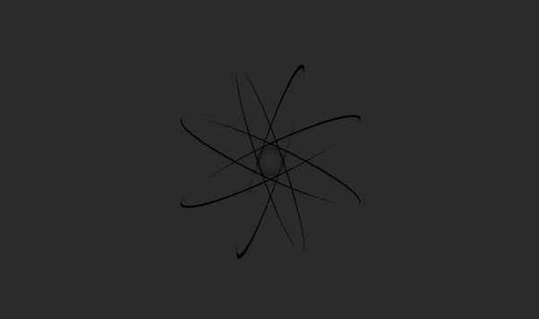

# AtomicCSS

Welcome to AtomicCSS! AtomicCSS is a repository within the AtomLink organization dedicated to providing essential CSS (HTML) stylesheets for web development projects. Our goal is to offer consistent and reusable styling components that contribute to efficient and cohesive web design across various pages and applications.

## Overview

> [!NOTE]
> The files `js/themeSwitcher.js` and `css/theme-transition.css` are added to the main code just to make them more useful.

1. **AtomicLoader:** A customizable loader component with smooth transitions and theme switching capabilities.
2. **AtomicSpinner:** An animated spinner component that can be easily integrated into web applications.

## Previews

### AtomicLoader Preview
<picture>
  <source media="(prefers-color-scheme: dark)" srcset="previews/dark/atomic-loader-preview.gif">
  <source media="(prefers-color-scheme: light)" srcset="previews/light/atomic-loader-preview.gif">
  
</picture>

### AtomicSpinner Preview

<picture>
  <source media="(prefers-color-scheme: dark)" srcset="previews/dark/atomic-spinner-preview.gif">
  <source media="(prefers-color-scheme: light)" srcset="previews/light/atomic-spinner-preview.gif">
  
</picture>

## License

This project is licensed under the [MIT License](LICENSE), allowing you to use, modify, and distribute the code for personal and commercial purposes. Refer to the [LICENSE](LICENSE) file for more details.

## Contributing

We welcome contributions to AtomicCSS! If you have improvements, bug fixes, or new features to contribute, please follow these guidelines:

1. Fork the repository and create a new branch for your changes.
2. Make your changes and ensure they are properly tested.
3. Submit a pull request with a clear description of your changes and their purpose.